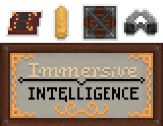

#
<p align="center"></p>   

[](https://discord.gg/teMfm3R)
[](https://www.patreon.com/bePatron?u=34304036)

## Who are you?  
We are a group of Minecraft modders, who mainly work on the mod [Immersive Intelligence](https://github.com/Team-Immersive-Intelligence/ImmersiveIntelligence), an addon to [Immersive Engineering](https://github.com/BluSunrize/ImmersiveEngineering).<br>
We plan to expand our portfolio of mods with new IE addons, to enhance the game even further.<br>
We do it as volunteers - people who just want to enjoy the game modded in their way ^^

## How it all began?
II started with [@Pabilo8](https://github.com/Pabilo8/), in April/May 2019. Since then, the mod has grown and many new features, planned back then were implemented. <br>
Then, the team expanded, with [@Carver](https://github.com/Carvercarver1) - the modeller and later [@Schäferd](https://github.com/Schaeferd-CZ) - the graphics artist, joining the efforts.<br>

## Our Team
```
Team Immersive Intelligence/
├── Code Department/
│   ├── @Pabilo8 (Pabilo8) - Project Lead, Programmer, probably can design a working battleship after a few beers
│   ├── @VDeltaGabriel (VDeltaGabriel) - Programmer, Assistant in Logical Design and a certified gradlephant tamer™
│   └── @Avalon (Avalon2106) - Programmer, helps us with miscellaneous fixes, works at the Department of Chemical Engineering
├── Art Department/
│   ├── @Carver (Carvercarver1) - Main Modeler, Animator, Archivist, Assistant, a fellow howitzer enthusiast, and world destroyer
│   ├── @Schäferd (Schaeferd-CZ) - UV Mapper, Texturer, Modeler, Animator, Artist, a fellow retro-futurist and also *The Czech™*
│   ├── @Peter (Cordyceps22) - 3D Modeler, Artist, helps and maintains order in our Russian-speaking community
│   ├── @Trej (trej32) - 3D Modeler, Texture, author of many vehicles, part of Trej-Tokarev Wagonzavod
│   └── @Tokarev (TokarevDrozd) - 3D Modeler, author of vehicles, the Soldier of II - he maintains order in Standards Documentation<br>
└── Paperwork Department/
    ├── Legal Department/
    │   ├── @Pabilo8 (Pabilo8) - Managing team's all legal needs<br>
    │   └── @VDeltaGabriel (VDeltaGabriel) - Managing team's internal licensing needs like tools licenses and more
    └── Documentation Department/
        ├── @Bastian (RexBas07) - Editor of the Engineer's Manual and the Future Ideas™ folder, cardboard boxes enjoyer, also *The Other Swede™*
        └── @VDeltaGabriel (VDeltaGabriel) - Responsible for any needed code and tools documentation
```

## Do you accept new members?
Sure! II has become a big project. Due to lack of time (uni, work) of our members, the progress is very slow.<br>
We are in need of a:
- Java Programmer - who will join Code Department    in the coding efforts
- Sound Designer - for making various Machine Noises™

For more positions and for contact to apply for them check our [site](https://www.iiteam.net/#new-members).

## What else do you do?
Aside all mentioned above, we also do research on new technologies in minecraft modding, such as 
- our 3D model format - AMT and a plugin for Blockbench, related to it
- our open-source sounds repository (WIP)
- motion capture for character animations using the Kinect sensor 
and a variety of utilities for MC modders.

Our main plan and final goal is to create a big modpack, based on the Immersive mod series, which will be like no modpack you've seen before... ^^
